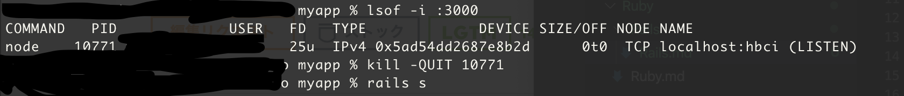

# Ruby on Rails
- `rails new アプリ名`で雛形を作成する
- アプリケーションを新規作成した後は`Bundller`を実行してアプリに必要なgemをインストールする
  - `アプリ名/Gemfile`に必要なものを書き加える
- `rails server (rails s)`でサーバーを起動
  - `Address already in use - bind(2) for "127.0.0.1" port 3000`というエラーが出たら・・・すでに同じポート番号のサーバーが使われている
    ```
    <Terminal>
    3000番ですでに繋がれてしまっているものを確認する
    lsof -i :3000

    kill -QUIT ~~~~
    ```

    

- RailsはRESTアーキテクチャで作られる
  - RailsアプリにおけるRESTとはアプリケーションを構成するコンポーネントを「リソース」としてモデル化することを指す

- 異なるデータモデル同士の関連付けができる

## app/
- MVCを含む主要なアプリケーションコード

## app/assets
- CSSやJS、画像など

## MVC(Model-View-Controller)
- RailsはMVCというアーキテクチャパターンを採用している
- アプリケーション内のデータ（ユーザー情報など）とデータを表示するコードを分離する

### MVCの挙動
- ブラウザから`/xxx`というURLのリクエストをRailsサーバーへ送信
- `/xxx`のリクエストはRailsのルーターにより`Xxxx`コントローラー内の`index`アクションに割り当てられる（ディスパッチ）
- `index`アクションが実行されそこから`Xxxx`モデルに`Xxxx.all`を呼び出す
- `Xxxx`モデルは呼び出しからデータをデータベースから取ってくる
- データベースから取ってきたデータの一覧を`Xxxx`モデルからコントローラーに返す
- `Xxxx`コントローラーはデータの一覧を`@xxx`変数に保存し、`index`ビューに渡す
- `index`ビューが起動し、ERBを実行してHTMLをレンダリングする
- コントローラーはビューで生成されたHTMLを受け取りブラウザへ返す

### Railsの通信
- ブラウザがRailsアプリと通信する際にリクエストがコントローラに渡される
- コントローラーはビューを生成してHTMLなどをブラウザへ返す
- 動的なサイトでは、DBとの通信を担っているモデルとコントローラがやりとりを行い、モデルを呼び出した後、コントローラーはビューを描画する

## ルーター
- コントローラーとブラウザの間に配置される
- ブラウザからのリクエストをコントローラに振り分ける
- rootの設定方法
  - `app/config/root.rb`の編集
  ```
  Rails.application.routes.draw do
  <!-- root 'controller_name#action_name' -->
  root application#hello
  end
  ```

## rails db:migrate
- データベースを更新して新しいデータモデルを作成する

## モデル、テーブルの操作
- 削除する場合
  - https://koooza.net/post-451

## パーシャル
- `_xxxx.html.erb` ←命名規則
- Reactとかでいうコンポーネントのイメージ？

## Active Record
- データを永続化するためにRailsではDBを使う
- DBとやり取りするデフォルトのRailsライブラリがActive Record
- Active RecordはORマッパー

## パスワードのハッシュ化
- `has_secure_password`で簡単にできる
  - DB内の`password_digest`という属性に保存できる
  - `password`と`password_confirm`という2つの仮想的な属性のペアが使えるようになる
  - `authenticate`メソッドが使えるようになる
- パスワードをハッシュ化するために、ハッシュ関数であるd`bcrypt`をGemFileに追加する

## シンボル
  - 文字列を通し番号で管理しているもの
  - 裏ではただの整数として管理している


## delegate
- あるメソッドを異なるクラス間で使えるようにできる

  ```
  delegate :foo, :bar, to: :something
  ```
  fooメソッドとbarメソッドをそれぞれsomethingメソッドへチェーン

## 論理削除と物理削除
- 物理削除・・・DB上からデータを削除すること
- 論理削除・・・表面上データを削除したように見せるが、DB上ではデータを残しておくこと

## クラスメソッドとインスタンスメソッド
- `self.class.クラスメソッド名`でクラスメソッドからインスタンスメソッドを呼び出す
### インスタンスメソッド
- class構文の中でメソッドを定義するとそのメソッドはインスタンスメソッドになる
- インスタンスメソッドはそのクラスのインスタンスに対して呼び出すことができるメソッド
- インスタンスに含まれるデータ（インスタンス変数）を読み書きする場合にはインスタンスメソッドを定義する
- 参照するには一回インスタンスを作る必要がある（名前からしても自明）

### クラスメソッド
- `self.クラス名`でクラスメソッドを定義できる
- インスタンスに紐付けず、クラスに対して働きかけるメソッド
- `class名.クラスメソッド名()`でクラスの外からクラスメソッドを呼び出すことができる